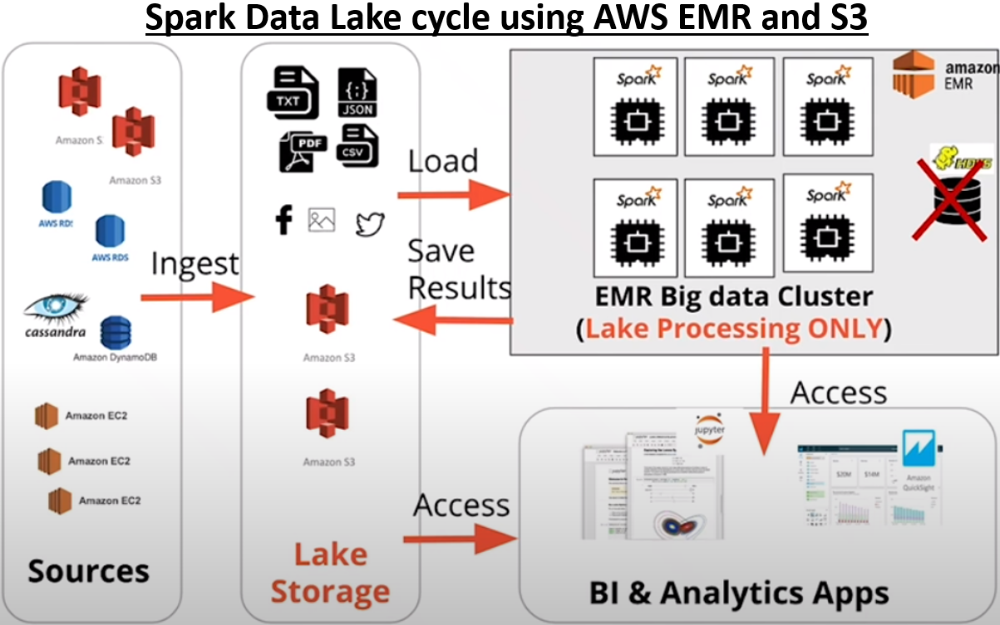
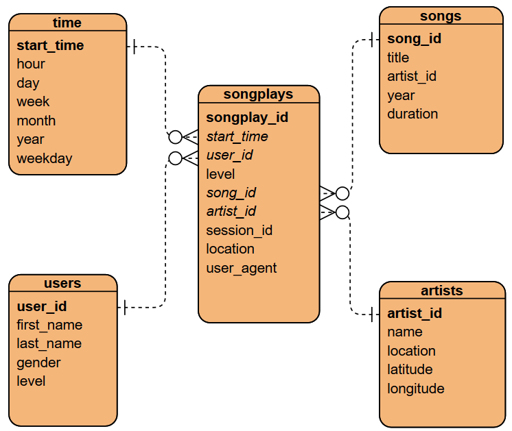
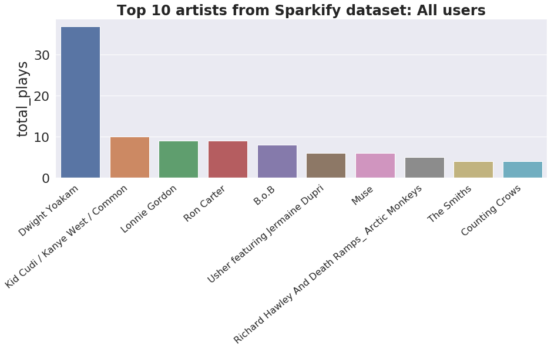

# Spark Data Lake
### Project from Udacity Data Engineering nanodegree
This project places myself as a Data Engineer for a fictional music streaming company called Sparkify. 
They have further expanded their user and song database and want to move their data warehouse to a data lake. 
The raw metadata resides on S3 as raw JSON files.

### Objectives
Build an ETL pipeline for a Spark Data Lake. The initial and final data are stored in S3, and the data processing is done using Spark. 
This Spark process is deployed using a cluster hosted on AWS.



*Spark Data Lake Option using AWS EMR and S3. HDFS not used, all data stored in S3. Data is loaded to EMR for processing, and saved back to S3.*
*The EMR cluster is spun-up on demand, shutdown otherwise.*
*Figure from Udacity lecture notes.*

### Song JSON data
The first dataset is a subset of real data from the [Million Song Dataset](http://millionsongdataset.com/).  
Each JSON file has metadata for a particular track, with the following fields:
- *num_songs, artist_id, artist_latitude, artist_longitude, artist_location, artist_name, song_id, title, duration, year*

### Log JSON data  
The second dataset is user songplay log files in JSON format generated by this [event simulator](https://github.com/Interana/eventsim). 
These simulate activity logs from a music streaming app based on specified configurations.  
Below is an example of what the data in 2018-11-12-events.json looks like:  
  

### Data Lake Schema
The image below shows the structure of the final analytic tables. 
It is a typical STAR schema, with the fact table (songplays) and 4 dimension tables. 
It is optimized for analytic queries to answer any questions on user songplay behavior! 



### Instructions and workflow (assuming a Linux setup)
1. Enter PEM file location, bootstrap path, and Subnet ID at the top of **run.sh**
2. Execute **run.sh** by typing ```source ./run.sh``` into the terminal. DO NOT FORGET to include ```source```. The bash file performs the following tasks:
    - Copies bootstrap file to users S3 location (so Spark can install Pandas upon cluster creation)
    - Creates an EMR cluster
    - Copies the Python scripts from this repo into the EMR cluster
    - SSH into the master node for direct connection to the cluster
3. Once connected to the EMR cluster, enter ```spark-submit src/etl.py``` to execute the Python processing script, which performs the following:
    - Creates a SparkSession
    - Loads the raw JSON metadata from Udacity S3 bucket. Processes the data. Writes to analytics tables in users S3 bucket (in parquet file format).
    - Reads the parquet files back into Spark
    - Runs some test SQL queries and save results as CSV files
4. Once the script is finished, type ```exit``` into the console. The **run.sh** file SHOULD then finish automatically:
    - Saves the log file and query results to the repo
    - Terminates the EMR cluster
5. Check ```logfile.log``` to ensure the table schemas are correct.
6. (Optional) Walk through **notebooks/visualize_queries.ipynb** to visualize the query results from the Spark job

### Extra work completed   
- Automated most of the workflow using Linux bash scripting **(run.sh)** and the AWS Command Line Interface (CLI) tool.
- Wrote the progress of the Spark job to ```logfile.log``` so the user can more easily identify the cause of any errors that might come up. 

### Sample spark.sql query for the top 10 most popular artists from the Sparkify dataset
```
SELECT a.name AS artist, COUNT(*) AS total_plays
FROM songplays s
JOIN artists a
ON s.artist_id = a.artist_id
GROUP BY a.name
ORDER BY total_plays DESC
LIMIT 10
```
  
